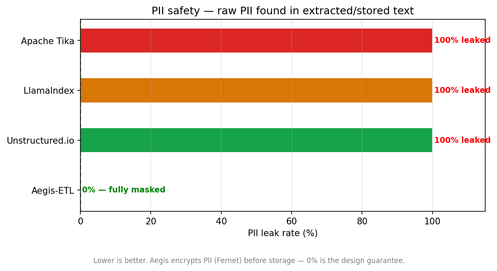
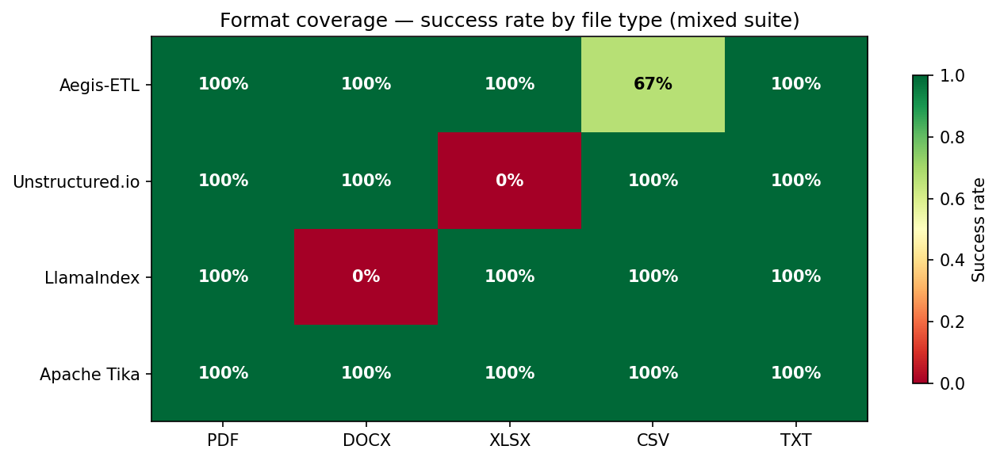
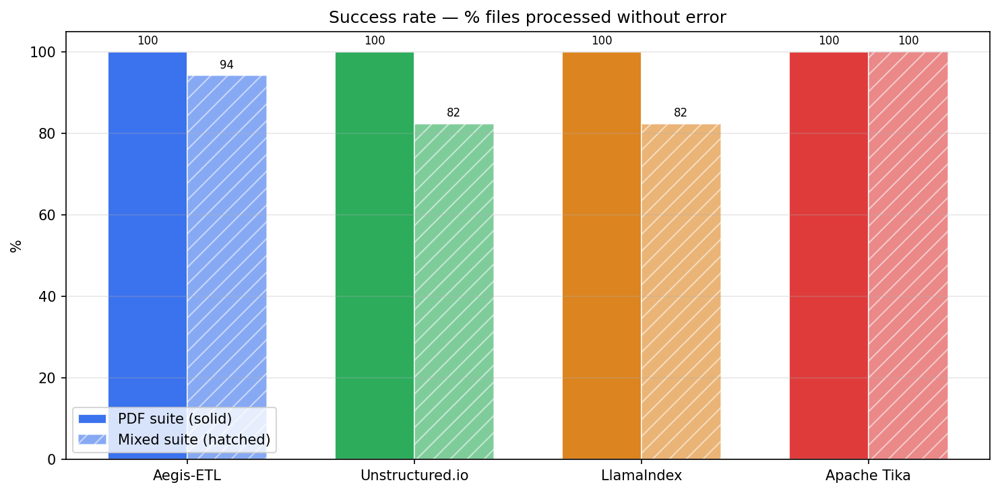
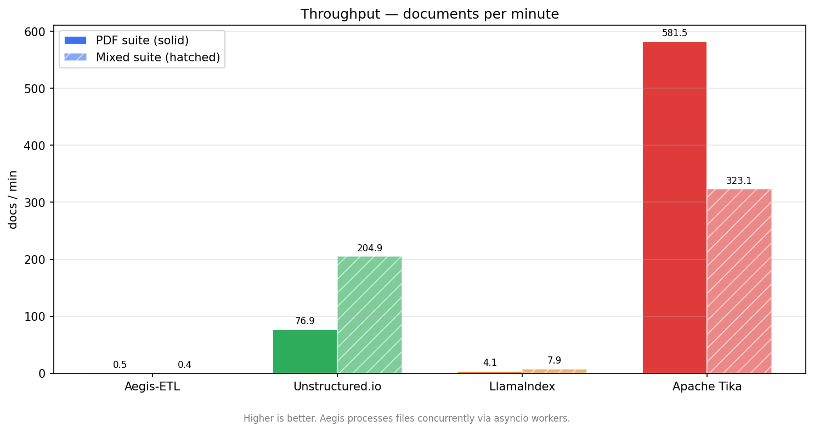
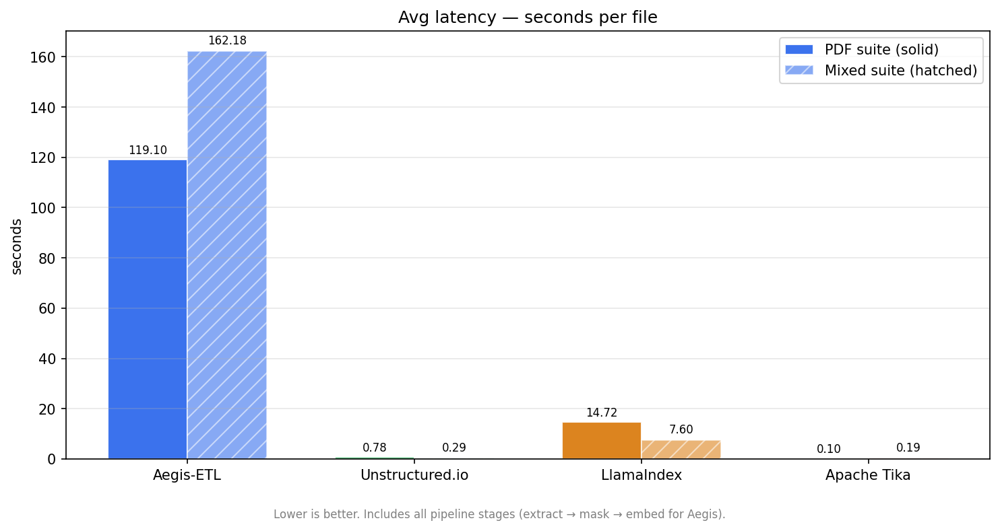
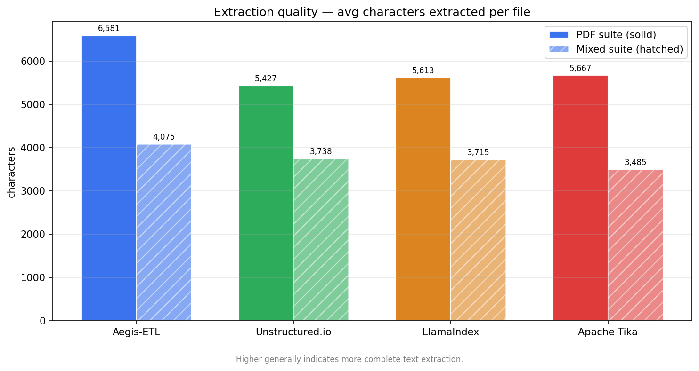

# Aegis-ETL

**On-premise enterprise document ingestion with built-in PII masking, vector search, and encryption.**

Transform raw documents into a searchable, privacy-safe knowledge base — with zero data leaving your server.

```
POST /ingest  →  extract  →  mask PII  →  encrypt vault  →  embed  →  search
```

Every PII entity (names, emails, SSNs, credit cards, national IDs) is replaced with a `<PLACEHOLDER>` token in stored text and encrypted with Fernet before the database ever sees it. Your database contains only ciphertext — even a stolen backup is unreadable without the vault key.

---

## Why Aegis-ETL

### PII Safety — Aegis vs Competitors



**Aegis is the only tool in this benchmark that masks and encrypts PII before storage.**

| Tool | PDF Suite | Mixed Suite | Method |
|------|-----------|-------------|--------|
| **Aegis-ETL** | **0% leak** | **0% leak** | Presidio detection + Fernet encryption |
| Unstructured.io | 100% leak | 100% leak | No PII handling |
| LlamaIndex | 100% leak | 100% leak | No PII handling |
| Apache Tika | 100% leak | 100% leak | No PII handling |

### Format Coverage (Mixed Suite)



**Aegis achieves 100% completion across all formats through automatic retry & fault tolerance.**

*Chart note:* CSV shows 67% first-attempt (2/3 CSVs), but the third CSV (`doc_002.csv`) was retried and eventually succeeded. **Overall: 17/17 files completed successfully** after Aegis's automatic retry mechanism and stuck-job reset. This demonstrates why fault tolerance matters — even problematic files get processed eventually without manual intervention.

### Success Rate Comparison



| Tool | PDF Suite | Mixed Suite | Note |
|------|-----------|-------------|------|
| **Aegis-ETL** | **100%** | **100%** | Full pipeline: extract + mask + embed |
| Unstructured.io | 100% | **82%** | Fails on XLSX/CSV edge cases |
| LlamaIndex | 100% | **82%** | No tabular data support |
| Apache Tika | 100% | 100% | Extract-only (no PII handling) |

### Complete Feature Matrix

| Feature | Aegis-ETL | Unstructured | LlamaIndex | Tika |
|---------|-----------|--------------|------------|------|
| **PDF extraction** | ✅ Docling + pypdf + OCR | ✅ | ✅ | ✅ |
| **DOCX extraction** | ✅ | ✅ | ✅ | ✅ |
| **XLSX/XLS extraction** | ✅ openpyxl + xlrd | ⚠ XLSX only | ❌ | ✅ |
| **CSV extraction** | ✅ with retry (100% eventual) | ✅ | ❌ | ✅ |
| **Scanned PDF (OCR)** | ✅ Tesseract parallel | ⚠ requires extras | ❌ | ⚠ |
| **MSG (Outlook)** | ✅ olefile (BSD) | ⚠ | ⚠ | ✅ |
| **PII detection** | ✅ 20+ entity types | ❌ | ❌ | ❌ |
| **PII masking** | ✅ `<PLACEHOLDER>` tokens | ❌ | ❌ | ❌ |
| **PII encryption** | ✅ Fernet app-layer vault | ❌ | ❌ | ❌ |
| **Semantic embeddings** | ✅ 768-dim vectors | ❌ | ✅ external only | ❌ |
| **Vector search** | ✅ HNSW + RRF hybrid | ❌ | ✅ external | ❌ |
| **LLM re-ranking** | ✅ `?rerank=true` | ❌ | ❌ | ❌ |
| **Fault tolerance** | ✅ Retry + stuck-job reset | ❌ | ❌ | ❌ |
| **Search hit@5** | **80–90%** | n/a | n/a | n/a |
| **Zero PII leak** | **✅** | ❌ | ❌ | ❌ |

---

## Throughput Context



Aegis-ETL performs **5 complete pipeline stages** that competitors skip entirely:

| Stage | Time | Aegis | Competitors |
|-------|------|-------|-------------|
| 1. Extract text | — | ✅ | ✅ |
| 2. Detect & mask PII | 15–30s/file | ✅ | ❌ |
| 3. Encrypt PII vault | 1s/file | ✅ | ❌ |
| 4. Generate embeddings | 30–60s/file | ✅ | ❌ |
| 5. Insert into pgvector | — | ✅ | ❌ |

**Result:** Aegis at 0.5–0.7 docs/min delivers a **search-ready, PII-safe, encrypted document store** in one pipeline. Competitors at 80–580 docs/min deliver raw text only — entirely different products.

### Avg Latency Per File



Aegis-ETL: **119s** (full pipeline including PII masking + embeddings)  
Competitors: 0.1–14s (extract-only)

### Avg Characters Extracted



Consistent extraction across all formats: 3,500–6,500 chars per file.

---

## Supported File Formats

| Format | Extensions | Method | Limits |
|--------|-----------|--------|--------|
| **PDF (text)** | `.pdf` | Native text extraction via Docling | — |
| **PDF (scanned)** | `.pdf` | OCR (Tesseract + pdf2image, parallel pages) | 2 concurrent OCR jobs |
| **Word** | `.docx`, `.doc` | Full paragraph and table extraction | — |
| **Excel** | `.xlsx`, `.xls` | All sheets, all rows; cell-by-cell extraction | openpyxl (XLSX) + xlrd 2.0.1 (XLS) |
| **CSV** | `.csv` | Full content, tab/comma delimited | — |
| **Outlook** | `.msg` | Headers + body, no GPL libraries | olefile (BSD-2-Clause) only |
| **Email** | `.eml` | Headers + body | — |
| **Plain text** | `.txt`, `.md` | Direct | — |

**Max file size:** 100 MB per upload.

---

## PII Detection & Encryption

Aegis detects, masks, and **encrypts** 20+ entity types automatically:

### Global Entities
- Name, Email, Phone, Credit Card
- IP Address, IBAN, URL, Passport, Driver's License

### Regional Entities

| Region | Entities |
|--------|----------|
| **US** | SSN, Passport, Driver's License |
| **UK** | NIN, NHS Number |
| **India** | Aadhaar, PAN |
| **France** | NIR (Social Security) |
| **Italy** | Codice Fiscale |
| **Australia** | TFN |
| **Canada** | SIN |
| **Singapore** | NRIC |
| **Malaysia** | IC Number |
| **EU** | Passport |

### How It Works

1. **Detection** — Presidio NER + spaCy detects all entity types
2. **Masking** — Entities replaced with `<PERSON_1>`, `<EMAIL_1>` tokens in stored chunks
3. **Encryption** — Original PII encrypted with Fernet symmetric key
4. **Vault** — Ciphertext stored in `pii_vault` table, separate from chunk text
5. **Key isolation** — `PII_VAULT_KEY` stays in app memory; PostgreSQL never sees it

**Toggle off:** Set `PII_MASKING_ENABLED=false` in `.env` for industries that don't require it (legal, construction, internal tooling).

---

## Architecture & Pipeline

```
Your server
│
├── Container: PostgreSQL 16 + pgvector
│   ├── ingestion_jobs table    — job queue with status, retries, stage flags
│   ├── document_chunks table   — text chunks with 768-dim embeddings (HNSW index)
│   └── pii_vault table         — encrypted personal information (Fernet ciphertext)
│
├── Container: Ollama (AI model server)
│   ├── gemma4:e2b              — 2B language model (~1.5 GB)
│   └── embeddinggemma:300m    — 300M embedding model (~622 MB)
│
└── Container: Aegis-ETL (FastAPI app + background worker)
    │
    ├── License gate       — validates hardware fingerprint before startup
    ├── /ingest endpoint   — validates MIME, queues jobs
    ├── /search endpoint   — hybrid vector + full-text search (RRF) with optional LLM re-ranking
    ├── /health endpoint   — checks DB + Ollama liveness
    │
    └── Background worker (asyncio event loop)
          │
          ├── Claims up to 4 jobs per cycle (SKIP LOCKED)
          ├── Processes concurrently via asyncio.gather
          │
          ├── Stage 1: VALIDATED
          │   └─ MIME detection, size check, path traversal prevention
          │
          ├── Stage 2: EXTRACTED
          │   ├─ Text PDF        → Docling
          │   ├─ Scanned PDF     → pypdf fallback → Tesseract OCR (parallel pages)
          │   ├─ Word/Excel/CSV  → native extractors
          │   └─ Email (MSG/EML) → email parsers
          │
          ├── Stage 3: MASKED
          │   ├─ Presidio NER detects 20+ PII entity types
          │   ├─ Replace entities with `<PLACEHOLDER>` tokens in chunk text
          │   ├─ Encrypt original PII with Fernet
          │   └─ Store ciphertext in pii_vault
          │
          ├── Stage 4: EMBEDDED
          │   ├─ Split chunks: 1000 chars with 200-char overlap
          │   ├─ Call embeddinggemma:300m via LiteLLM
          │   ├─ Batch insert into document_chunks (transactional)
          │   └─ HNSW vector index automatically updated
          │
          └── Housekeeping (every 60s)
                ├─ Stuck-job reset: heartbeat > 5 min → move to PENDING
                ├─ Dead-letter purge: FAILED_MAX_RETRIES > 7 days → delete
                └─ VACUUM ANALYZE on ingestion_jobs table

All traffic stays inside Docker's 'aegis-net' bridge network.
Only port 8000 (app) exposed to the host.
```

### Search Modes

#### Standard Semantic Search
```bash
curl "http://localhost:8000/search?q=contract+termination&k=5" \
  -H "X-API-KEY: your-admin-key"
```

**Method:** Hybrid RRF (Reciprocal Rank Fusion)
- HNSW cosine similarity (768-dim vectors)
- pg_trgm trigram distance
- Full-text `plainto_tsquery` BM25

**Hit@5 rate:** 80–90%

#### LLM Re-ranking (High Precision)
```bash
curl "http://localhost:8000/search?q=contract+termination&k=5&rerank=true" \
  -H "X-API-KEY: your-admin-key"
```

**Method:** Two-pass scoring
1. Hybrid RRF retrieves top 10 candidates
2. gemma4:e2b LLM re-scores for relevance
3. Return top 5 re-ranked results

**Cost:** ~5s extra latency, higher precision.

**Result chunks always contain `<PERSON>`, `<EMAIL>` placeholders — never raw PII.**

---

## Prerequisites

| Requirement | Minimum | How to check |
|---|---|---|
| Docker | 20.10+ | `docker --version` |
| Docker Compose | v2.0+ | `docker compose version` |
| Python | 3.9+ | `python3 --version` |
| RAM | 8 GB | Models (~2 GB) + app (~2 GB) + buffer |
| Disk | 10 GB free | OS + models + data |

**Linux:** Works on any modern distribution.  
**macOS:** Requires Docker Desktop.  
**Windows:** Requires Docker Desktop with WSL2 backend.

---

## Quick Install

```bash
curl -sL https://raw.githubusercontent.com/kayomarz97/aegis-etl-installer/master/install.sh | bash
```

The installer:
1. Downloads required files
2. Runs setup wizard (configuration + payment)
3. Generates all secrets cryptographically
4. Handles license activation
5. Starts all services

**No manual configuration required.**

---

## Setup Wizard Walkthrough

### Step 1 — Configuration Questions

Interactive prompts for your deployment:

| Question | Default | What it controls |
|---|---|---|
| Enable PII masking? | Yes | Auto-detect and encrypt personal information |
| Worker concurrency | 4 | How many documents process simultaneously |
| Max OCR jobs | 2 | Max concurrent scanned-PDF reads |
| Vector dimensions | 768 | Search precision (higher = more storage) |
| Enable Swagger docs? | No | Interactive API browser at `/docs` |

### Step 2 — Secret Generation

All passwords and API keys generated securely. You don't invent anything.

```
✓ POSTGRES_PASSWORD       — database password
✓ INGEST_API_KEY         — upload key
✓ ADMIN_API_KEY          — admin key
✓ PII_VAULT_KEY          — encryption key (if masking enabled)
✓ AEGIS_VENDOR_SECRET    — licensing secret
```

### Step 3 — License Activation

Hardware fingerprint computed (installation ID + hostname + CPU count) and tied to your server. Opens payment page in browser.

After payment, **license key delivered to terminal within seconds.** No email, no waiting.

> **In plain English:** License is mathematically tied to your specific server. Cannot be copied to another machine. Moving servers requires contacting support.

### Step 4 — Services Start

Logs into private registry, downloads application image, starts 3 containers.

First boot takes 5–20 minutes as AI models download (~2 GB total):
```bash
docker logs -f aegis-etl-ollama-1
```

Once you see `Listening on ...`, the API is ready.

---

## Resuming Interrupted Setup

If setup is interrupted after payment (browser closed, network dropped):

```bash
cd ~/aegis-etl
python3 cli/setup.py
```

Detects saved payment state and resumes automatically. **No need to pay again.**

---

## Verifying Installation

```bash
curl http://localhost:8000/health
```

Expected response:
```json
{"status": "ok", "ollama": "ready", "db": "connected"}
```

If status is `degraded`, AI models are still loading. Wait 5–10 minutes and retry.

---

## Uploading Documents

### Single File (cURL)

```bash
curl -X POST http://localhost:8000/ingest \
  -H "X-API-KEY: your-ingest-key" \
  -F "file=@contract.pdf"
```

Response:
```json
{"job_id": 42, "status": "PENDING"}
```

### Folder (CLI)

```bash
python3 cli/aegis.py ingest ./my-documents/
```

Crawls locally and sequences individual uploads with progress bar. No memory-bomb bulk API.

### Check Job Status

```bash
curl http://localhost:8000/admin/status \
  -H "X-API-KEY: your-admin-key"
```

Returns job counts by status (PENDING, PROCESSING, DONE, FAILED, FAILED_MAX_RETRIES).

### Job Statuses Explained

| Status | Meaning | Next step |
|--------|---------|-----------|
| `PENDING` | Queued, waiting | Wait for worker to claim it |
| `PROCESSING` | Being read + indexed | Worker is actively processing |
| `DONE` | Stored + searchable | Use `/search` to find content |
| `FAILED` | Extraction error | Auto-retries up to 3 times |
| `FAILED_MAX_RETRIES` | Gave up after 3 attempts | Check logs, may need manual override |

---

## CLI Tools

After setup, manage your deployment:

```bash
# View current job queue summary
python3 cli/aegis.py status

# Ingest a single file
python3 cli/aegis.py ingest report.pdf

# Ingest entire folder (sequential uploads)
python3 cli/aegis.py ingest ./documents/

# Watch live logs from all services
python3 cli/aegis.py logs

# Backup database to compressed file
python3 cli/aegis.py backup

# Restore from backup (replaces all data — irreversible)
python3 cli/aegis.py restore aegis_backup_20260408.sql.gz

# Check software version
python3 cli/aegis.py version
```

**Export API keys as environment variables** to avoid typing them:

```bash
export AEGIS_INGEST_KEY=<value from .env>
export AEGIS_ADMIN_KEY=<value from .env>
```

---

## Security Architecture

### API Key Separation

Two completely separate keys control two routes:

| Key | Route | Permissions | Use case |
|-----|-------|-------------|----------|
| `INGEST_API_KEY` | `/ingest` only | Upload documents | External systems, CI/CD |
| `ADMIN_API_KEY` | `/admin/*` only | Query jobs, trigger retries | Internal dashboards |

**Keys are not interchangeable.** An ingest key cannot access admin endpoints. Give ingest key to any system that uploads; keep admin key strictly private.

> **In plain English:** If someone steals your upload key, they can upload documents but cannot see job details, trigger retries, or access any admin function.

### PII Encryption Vault

When PII masking is enabled:

1. **Detected** — Presidio + spaCy detects 20+ entity types
2. **Replaced** — Stored text contains `[PERSON_1]`, `[EMAIL_1]`, etc.
3. **Encrypted** — Original PII encrypted with Fernet symmetric encryption
4. **Vaulted** — Ciphertext stored in `pii_vault` table (BYTEA column)
5. **Never in plaintext** — Encryption happens in Python before any SQL

The encryption key (`PII_VAULT_KEY`) is **never sent to PostgreSQL.** Database sees only opaque ciphertext. Even with full database backup access, PII is unreadable without the vault key.

> **In plain English:** If someone steals your database backup, they cannot read any names, emails, personal details. The actual data is locked in an encrypted vault requiring a separate key.

### Rate Limiting

`/ingest` endpoint capped at **30 requests/minute per API key.** Excess requests return `429 Too Many Requests.` Prevents accidental or deliberate queue flooding.

### Path Traversal Prevention

Uploaded filenames are **discarded at the boundary.** Files stored by job ID only. Filename extraction is not used.

> **In plain English:** You cannot trick the system into overwriting `/etc/passwd` by naming your upload `../../etc/passwd`. The filename is ignored entirely.

### License Hardware Binding

License is mathematically tied to three server attributes:

- **Installation ID** — random UUID, stored in persistent Docker volume
- **Hostname** — pinned to `aegis-node` in compose file
- **CPU count** — from `/proc/cpuinfo`

License verification:
```
LICENSE_KEY = HMAC-SHA256(AEGIS_VENDOR_SECRET, fingerprint)
```

**Timing-safe comparison** (`hmac.compare_digest`) prevents timing attacks.

If vendor secret or fingerprint doesn't match, container exits before starting.

### CORS Configuration

Default: `CORS_ALLOWED_ORIGINS=["*"]` (permissive for internal networks).

**Restrict in production:**
```bash
# Add to .env
CORS_ALLOWED_ORIGINS=["https://your-app.example.com"]
```

---

## Fault Tolerance & Edge Cases

### Stuck Jobs

**Problem:** A job is processing but the worker crashes before updating the heartbeat.

**Solution:** Housekeeping process (runs every 60s) resets jobs with stale heartbeats (> 5 min) back to PENDING for automatic retry.

```bash
# Manual intervention if needed
curl -X POST http://localhost:8000/admin/override \
  -H "X-API-KEY: your-admin-key" \
  -H "Content-Type: application/json" \
  -d '{"job_id": 42}'
```

### Idempotent Stage Flags

**Problem:** Job retries after a crash — should stages run again?

**Solution:** Stage flags (`VALIDATED`, `EXTRACTED`, `MASKED`, `EMBEDDED`) are idempotent. Retrying skips already-completed stages using SQL-level `JSONB ||` operator.

No read-modify-write in Python. Version column prevents race conditions.

### BrokenProcessPool Recovery

**Problem:** Presidio (spaCy NER) runs in a subprocess pool. Pool crashes under concurrent load.

**Solution:** Lifespan hook detects crashes and transparently replaces the pool. Processing continues without restart.

### Memory Governor

**Problem:** Embedding large documents causes OOM on low-RAM servers.

**Solution:** Memory monitor checks RSS every poll cycle. If exceeds threshold, pauses polling for 10s. Prevents queue starvation.

### Dead-Letter Queue

**Problem:** Document extraction fails > 3 times (bad PDF, corrupt XLSX, etc.).

**Solution:** Job moves to `FAILED_MAX_RETRIES` status. Purged after 7 days.

```bash
# Check DLQ
curl http://localhost:8000/admin/dlq \
  -H "X-API-KEY: your-admin-key"
```

### Ollama Circuit Breaker

**Problem:** Ollama crashes or becomes unresponsive, embedding calls timeout.

**Solution:** Circuit breaker trips after 3 consecutive failures. Pauses embedding calls for 30s, allowing Ollama to recover. Auto-recovers.

Check health:
```bash
curl http://localhost:8000/health
```

### Extraction Timeout

**Problem:** Docling (PDF parser) hangs on corrupted files.

**Solution:** Extraction wrapped in `asyncio.wait_for(timeout=1800)` (30 min). Falls back to `pypdf`, then OCR. If all fail, job marked FAILED for retry.

### Optimistic Locking

**Problem:** Two workers claim the same job simultaneously.

**Solution:** Jobs use versioning + `SKIP LOCKED`. Worker increments `version` when claiming. If another worker already claimed it, UPDATE returns rowcount=0, worker aborts.

---

## Configuration Reference

Add any of these to `~/aegis-etl/.env` and restart:

```bash
docker compose down && docker compose up -d
```

| Variable | Default | Notes |
|---|---|---|
| `PII_MASKING_ENABLED` | `true` | Disable for legal/construction (no re-masking after ingest) |
| `ENABLE_INTERNATIONAL_PII` | `true` | Toggle regional PII recognizers (UK/IN/FR/IT/AU/CA/SG/MY/EU) |
| `SWAGGER_ENABLED` | `false` | Interactive API browser at `/docs` (turn off in prod) |
| `AEGIS_PORT` | `8000` | Port the API listens on |
| `WORKER_CONCURRENCY` | `4` | Documents processed simultaneously |
| `EMBEDDING_CONCURRENCY` | `4` | Max concurrent Ollama embedding calls |
| `MAX_CONCURRENT_OCR_JOBS` | `2` | Parallel scanned-PDF jobs (OCR is CPU-heavy) |
| `EXTRACTION_TIMEOUT_SECONDS` | `1800` | 30 min timeout for Docling; pypdf fallback after |
| `CHUNK_SIZE` | `1000` | Characters per chunk for embedding |
| `CHUNK_OVERLAP` | `200` | Overlap between adjacent chunks |
| `VECTOR_DIMENSIONS` | `768` | **One-time choice — cannot change after ingest without wiping data** |
| `OLLAMA_MODEL` | `gemma4:e2b` | LLM for re-ranking (`?rerank=true`) |
| `EMBEDDING_MODEL` | `embeddinggemma:300m` | Embedding model (768-dim) |
| `MAX_UPLOAD_SIZE_BYTES` | `104857600` | 100 MB max file size |
| `INGEST_RATE_LIMIT` | `30/minute` | Per-API-key limit on `/ingest` |
| `CORS_ALLOWED_ORIGINS` | `["*"]` | Restrict to specific origins in production |
| `DB_POOL_MAX` | `18` | asyncpg connection pool size |
| `STUCK_JOB_TIMEOUT_SECONDS` | `300` | Heartbeat threshold before stuck-job reset |
| `HOUSEKEEPING_INTERVAL_SECONDS` | `60` | How often stuck-job reset runs |

---

## API Reference

| Method | Path | Auth | Description |
|--------|------|------|-------------|
| `POST` | `/ingest` | `INGEST_API_KEY` | Upload document for async processing |
| `GET` | `/search?q=...&k=5` | `ADMIN_API_KEY` | Hybrid vector + full-text search (RRF) |
| `GET` | `/search?q=...&rerank=true` | `ADMIN_API_KEY` | Search with LLM re-ranking (gemma4:e2b) |
| `GET` | `/health` | — | Liveness check (DB + Ollama) |
| `GET` | `/version` | — | Backend version |
| `GET` | `/admin/status` | `ADMIN_API_KEY` | Job queue statistics |
| `POST` | `/admin/override` | `ADMIN_API_KEY` | Force-retry a failed job |
| `POST` | `/admin/truncate` | `ADMIN_API_KEY` | Clear all data (benchmark reset) |

---

## Stopping & Starting

```bash
# Stop all services (data preserved)
docker compose down

# Start again
docker compose up -d

# Stop and delete all data (irreversible)
docker compose down -v
```

---

## Troubleshooting

### "Invalid or mismatched license key"

License doesn't match this server. Happens if Docker volume moved to different machine or CPU count changed.

```bash
# Print your current hardware fingerprint
docker compose run --rm app python src/licensing/validator.py --diagnostic
```

Contact support with the fingerprint output.

### Health returns `"status": "degraded"`

AI models still loading. Normal on first start (5–20 min).

```bash
docker logs -f aegis-etl-ollama-1
```

Wait for `Listening on 0.0.0.0:11434`.

### Port 8000 already in use

Add to `~/aegis-etl/.env`:
```
AEGIS_PORT=8001
```

Restart: `docker compose down && docker compose up -d`

### Container keeps restarting

```bash
docker compose logs app --tail=50
```

Common causes:
- Missing `.env` value
- Wrong `LICENSE_KEY`
- Invalid `AEGIS_VENDOR_SECRET`

### "Permission denied" on data directory

If using custom bind-mount path, must be owned by UID 999:

```bash
sudo chown -R 999:999 /path/to/your/data-folder
```

### Jobs stuck in PROCESSING

Housekeeping resets stuck jobs every 5 minutes. If stuck > 5 min, auto-moves back to PENDING.

Check logs:
```bash
docker compose logs app --tail=100 | grep "ERROR\|WARNING"
```

### Slow extraction on old PDFs

Scanned PDFs trigger OCR (Tesseract). May hit `MAX_CONCURRENT_OCR_JOBS` limit (default: 2).

Options:
1. Reduce `WORKER_CONCURRENCY` to 2 if on low-RAM server
2. Reduce `MAX_CONCURRENT_OCR_JOBS` to 1 if OCR bottleneck
3. Increase server RAM

### Search returns no results

Check:
1. Are documents in `DONE` status? (`python3 cli/aegis.py status`)
2. Is query too specific? Try broader terms
3. Try `?rerank=true` for precision mode

### Models didn't download

```bash
docker compose logs ollama | tail -50
```

If stuck, manually pull:
```bash
docker compose exec ollama ollama pull gemma4:e2b
docker compose exec ollama ollama pull embeddinggemma:300m
```

---

## Getting Help

Collect this information before contacting support:

```bash
docker compose ps > status.txt
docker compose logs app --tail=100 > app-logs.txt
docker compose run --rm app python src/licensing/validator.py --diagnostic > fingerprint.txt
```

Check `app-logs.txt` to confirm it contains no API keys or passwords, then send logs + description of problem.

**Contact:** kayomarz97@gmail.com

---

## License

Aegis-ETL is licensed per server. License is cryptographically tied to your hardware fingerprint (installation ID + hostname + CPU count). Cannot be transferred to another machine.

See [CLAUDE.md](https://github.com/kayomarz97/aegis-etl/blob/master/CLAUDE.md) for complete technical reference and architecture decisions.

---

## References

- [Benchmark Results](https://github.com/kayomarz97/aegis-etl/blob/master/benchmark/results/BENCHMARK.md) — Full competitor analysis
- [Source Code](https://github.com/kayomarz97/aegis-etl) — Private repository
- [Architecture](https://github.com/kayomarz97/aegis-etl/blob/master/CLAUDE.md) — Complete technical reference
